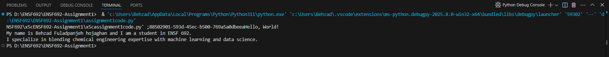
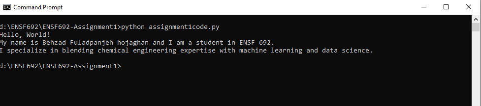

# ENSF692 Assignment1
A repository to practice github steps.

Author: Behzad Fuladpanjeh Hojaghan

"Success is not final, failure is not fatal: It is the courage to continue that counts." – Winston S. Churchill

# How to run the program
The Python program `assignment1code.py` greets the world and prints student name. 

1. Open Visual Studio Code, then open `assignment1code.py` using File menu.
2. From Run menu, select Run without debugging.
3. The VS Code, will run the code and output should look like this:

4. The code also can be executed from terminal: `python assignment1code.py` after changing directory to the assignment folder.
The output should look like this:
